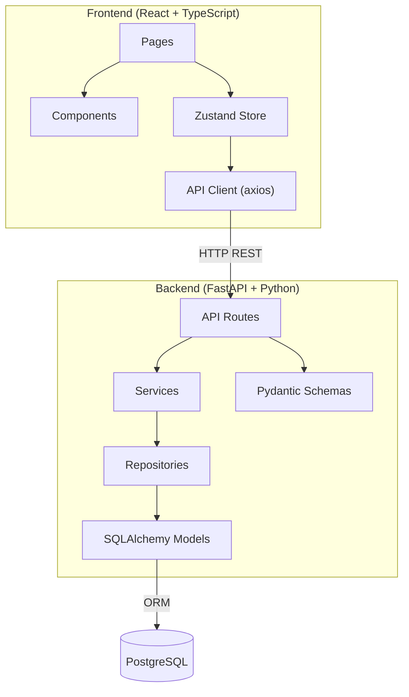

# Knowledge Workspace

A full-stack productivity application where users can organize their notes into projects.

## Tech Stack

| Layer      | Technology                        |
|------------|-----------------------------------|
| Frontend   | React, TypeScript, Vite, Zustand, shadcn/ui |
| Backend    | Python, FastAPI, SQLAlchemy, Pydantic |
| Database   | PostgreSQL (via Docker)           |

## Architecture

```
User → React UI → Zustand Store → Axios API Client
         ↕ HTTP (REST)
FastAPI Routes → Pydantic Validation → Service Layer → Repository Layer → SQLAlchemy → PostgreSQL
```



## Getting Started

### Prerequisites
- Node.js 18+, pnpm
- Python 3.10+, uv
- Docker & Docker Compose

### 1. Start the Database
```bash
cd infrastructure
docker-compose up -d
```

### 2. Start the Backend
```bash
cd backend
uv run uvicorn app.main:app --reload
```
Backend runs at: http://localhost:8000  
API docs at: http://localhost:8000/docs

### 3. Start the Frontend
```bash
cd frontend
pnpm dev
```
Frontend runs at: http://localhost:5173

## Project Structure

```
project-root/
├── frontend/          # React + TypeScript application
├── backend/           # FastAPI + Python application
├── infrastructure/    # Docker configuration
├── docs/              # Architecture documentation
└── README.md
```
