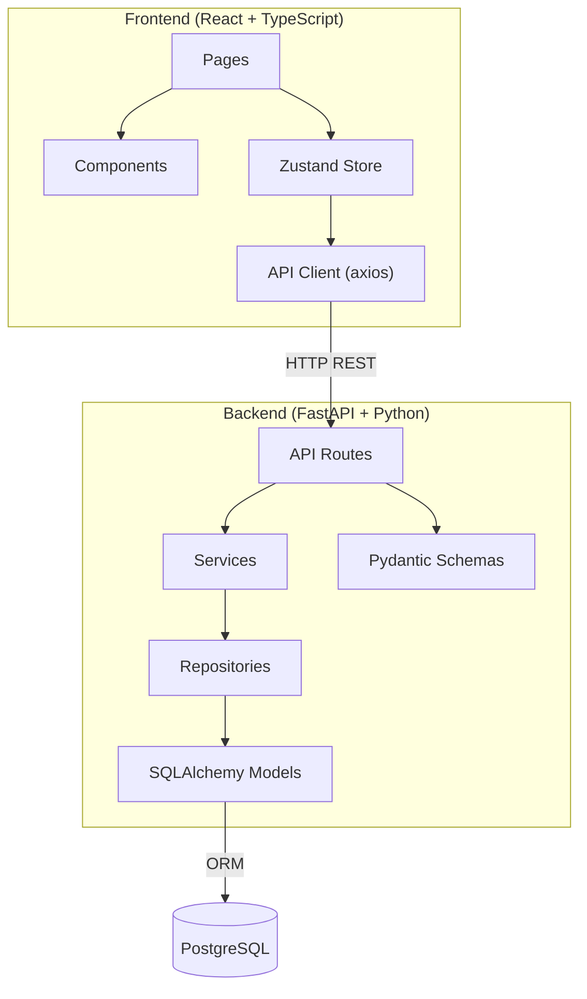

# Knowledge Workspace — Implementation Plan

A full-stack productivity app where users organize notes into projects. Built with **FastAPI + PostgreSQL** (backend) and **React + TypeScript** (frontend), designed as a learning project with extensive comments and explanations in every file.

## System Architecture Overview

**Data flows top-to-bottom**: User interacts with React Pages → triggers Zustand state changes → calls API client → hits FastAPI routes → validated by Pydantic schemas → processed by service layer → persisted via repository layer → stored in PostgreSQL.

---

## Proposed Changes

### Infrastructure

#### [NEW] [docker-compose.yml](file:///home/rakshith/Desktop/learnings/fastReact/infrastructure/docker-compose.yml)
- PostgreSQL 16 container with persistent volume
- Mapped to port `5432`

#### [NEW] [.env](file:///home/rakshith/Desktop/learnings/fastReact/.env)
- Database URL, JWT secret key, algorithm, token expiry

#### [NEW] [README.md](file:///home/rakshith/Desktop/learnings/fastReact/README.md)
- Project overview, setup instructions, architecture diagram

---

### Backend — Core Layer

#### [NEW] [config.py](file:///home/rakshith/Desktop/learnings/fastReact/backend/app/core/config.py)
- Loads environment variables using Pydantic `BaseSettings`

#### [NEW] [database.py](file:///home/rakshith/Desktop/learnings/fastReact/backend/app/core/database.py)
- SQLAlchemy engine creation, session factory, `Base` declarative class

#### [NEW] [security.py](file:///home/rakshith/Desktop/learnings/fastReact/backend/app/core/security.py)
- Password hashing (bcrypt via passlib), JWT token creation & verification (python-jose)

---

### Backend — Models (SQLAlchemy)

#### [NEW] [user.py](file:///home/rakshith/Desktop/learnings/fastReact/backend/app/models/user.py)
- `users` table: id, email, hashed_password, full_name, created_at
- Relationship: `user.projects` → list of projects

#### [NEW] [project.py](file:///home/rakshith/Desktop/learnings/fastReact/backend/app/models/project.py)
- `projects` table: id, title, description, user_id (FK), created_at, updated_at
- Relationship: `project.notes` → list of notes

#### [NEW] [note.py](file:///home/rakshith/Desktop/learnings/fastReact/backend/app/models/note.py)
- `notes` table: id, title, content, project_id (FK), created_at, updated_at

---

### Backend — Schemas (Pydantic)

One schema file per domain: `user.py`, `project.py`, `note.py` — each containing Create, Update, and Response schemas.

---

### Backend — Repositories (DB Access)

One repository per domain: `user_repository.py`, `project_repository.py`, `note_repository.py` — pure database CRUD operations.

---

### Backend — Services (Business Logic)

- `auth_service.py` — register, authenticate, get current user
- `project_service.py` — CRUD with ownership checks
- `note_service.py` — CRUD with project ownership checks

---

### Backend — API Routes

- `api/auth.py` — `POST /auth/register`, `POST /auth/login`, `GET /auth/me`
- `api/projects.py` — full CRUD at `/projects`
- `api/notes.py` — full CRUD at `/projects/{project_id}/notes` and `/notes/{id}`

#### [NEW] [main.py](file:///home/rakshith/Desktop/learnings/fastReact/backend/app/main.py)
- FastAPI app, CORS middleware, router mounting, DB table auto-creation on startup

---

### Frontend — Setup & Core

- Initialize with `pnpm create vite` (React + TypeScript template)
- Install: `shadcn/ui`, `zustand`, `axios`, `react-router-dom`
- Create folder structure: `api/`, `components/`, `features/`, `hooks/`, `pages/`, `store/`, `types/`, `utils/`

#### Key files:
| File | Purpose |
|------|---------|
| `types/index.ts` | TypeScript interfaces for User, Project, Note |
| `api/client.ts` | Axios instance with JWT interceptor |
| `api/auth.ts`, `api/projects.ts`, `api/notes.ts` | API service functions |
| `store/authStore.ts` | Zustand store for auth state |
| `store/projectStore.ts` | Zustand store for projects |
| `store/noteStore.ts` | Zustand store for notes |

---

### Frontend — Pages & Components

| Page | Route | Description |
|------|-------|-------------|
| LoginPage | `/login` | Login form |
| RegisterPage | `/register` | Registration form |
| DashboardPage | `/dashboard` | Grid of user's projects |
| ProjectPage | `/projects/:id` | Notes list inside a project |
| NoteEditorPage | `/projects/:id/notes/:noteId` | Edit a note |

Shared components: `Sidebar`, `ProjectCard`, `NoteCard`, `ProtectedRoute`, `Layout`

---

## User Review Required

> [!IMPORTANT]
> **PostgreSQL via Docker**: The plan uses Docker Compose to run PostgreSQL. Make sure Docker is running on your machine before we start.

> [!NOTE]
> **SQLite alternative**: If you prefer to avoid Docker/PostgreSQL for now, I can use SQLite instead (just a file, no setup needed). Let me know your preference.

> [!NOTE]
> **Authentication**: The plan uses JWT tokens (stateless auth). Tokens are stored in `localStorage` on the frontend. This is standard for learning projects but not the most secure approach for production.

---

## Verification Plan

### Automated — Backend API Testing
1. **Start PostgreSQL**: `cd infrastructure && docker-compose up -d`
2. **Start backend**: `cd backend && uv run uvicorn app.main:app --reload`
3. **Test via interactive docs**: Open `http://localhost:8000/docs` (Swagger UI) in browser
   - Register a user → Login → Use token → Create project → Create notes → Verify all CRUD operations

### Automated — Frontend Verification
1. **Start frontend**: `cd frontend && pnpm dev`
2. **Browser test**: Open `http://localhost:5173` in browser
   - Register → Login → Create project → Add notes → Edit/delete → Verify UI updates

### End-to-End Flow (Browser)
1. Run both backend and frontend simultaneously
2. Walk through full user journey in the browser: Register → Login → Dashboard → Create Project → Add Note → Edit Note → Delete Note → Delete Project → Logout

### Manual Verification (User)
- **You** can verify the final result by following the E2E flow above. I'll provide exact steps when we reach that stage.
